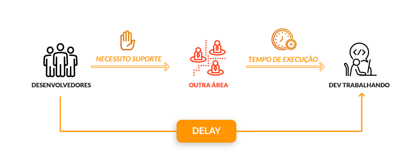
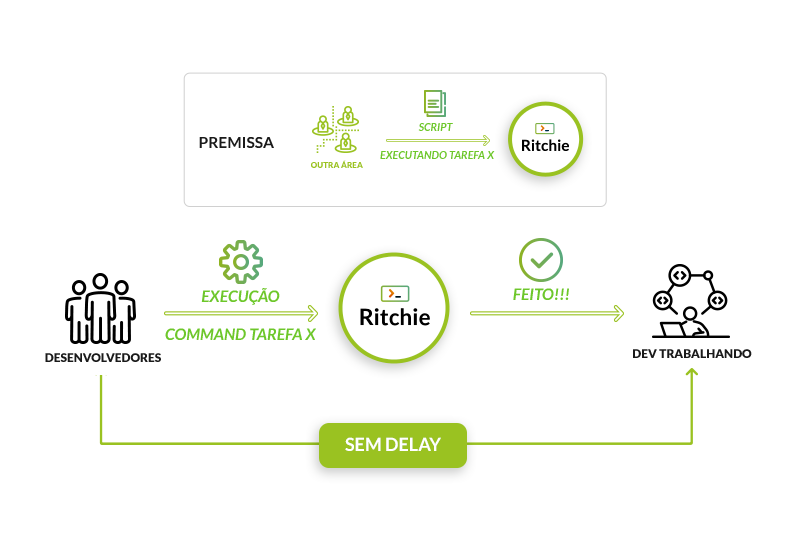

# Overview

## O que é o Ritchie ?

O Ritchie é um **CLI** \(Command Line Interface\) que permite **criar, armazenar e compartilhar** automações de forma **simples** e **segura** 🔓 com uma equipe de profissionais ou com a comunidade inteira.

## **O que o Ritchie faz?**

A ferramenta permite criar automações \(chamadas de **fórmulas** no contexto do Ritchie\) que são executadas via linhas de comando e, assim, torna o trabalho de programação mais fácil no dia a dia. Na prática, o Ritchie funciona como um repositório único de fórmulas.   
  
Confira no nosso vídeo um pouco mais do projeto: 



## Instalação

Ritchie é um CLI que funciona para **todos os sistemas operacionais.** Para saber mais informações de como instalar na sua máquina, basta clicar no sistema de sua preferência:







### **Linguagens de programação**

Ritchie foi desenvolvido usando a linguagem do Google, o **Golang**. No entanto, as fórmulas podem ser escritas usando qualquer linguagem de programação.

### Ferramentas

Além da variedade de linguagens para se usar com Ritchie, o projeto também possibilita trabalhar com **qualquer ferramenta de automação**, como por exemplo: 

## Como Ritchie funciona?

O processo comum para executar um projeto é criar uma infraestrutura prévia, definindo a linguagem em que o sistema será programado, baixando dependências e definindo as regras que devem ser usadas para projeto.

Com o Ritchie, é possível fazer o setup do projeto por meio de uma fórmula, o que permite criar essa infraestrutura via uma linha de comando. Nesse caso, o sistema entrega as pastas do projeto com todos os arquivos configurados automaticamente e, assim, evitamos um gasto de tempo em infraestrutura e configurações.

## O que torna o Ritchie único ?

Por ser uma ferramenta de CLI, o Ritchie busca melhorar a experiência operacional dos desenvolvedores e traz benefícios como:

* Simplificar tarefas repetitivas e de fácil execução
* Reduzir o retrabalho 
* Promover mais tempo para que o time de desenvolvimento foque em suas entregas.

Ao invés de sinalizar nas linhas de comando quais parâmetros e/ou argumentos o usuário precisa informar, fazemos o contrário: o Ritchie apresenta as opções disponíveis e vai, linha a linha, perguntando as informações necessárias para o comando funcionar, de forma interativa.

No exemplo abaixo, temos a execução de um comando scaffold com a fórmula coffee. À medida que o usuário sinaliza qual a fórmula quer utilizar, o sistema automaticamente passa, linha a linha, a perguntar quais parâmetros específicos devem ser considerados para executar a ação desejada.  

