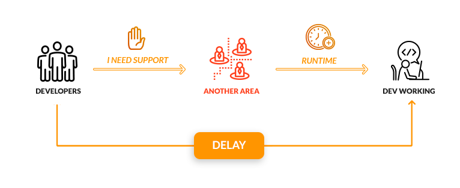
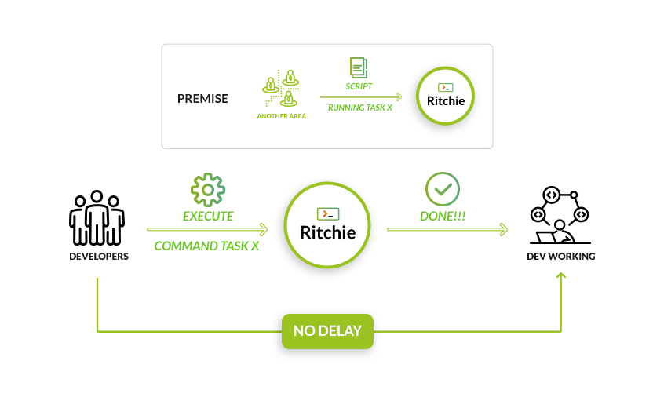

# Visão geral

## O que é o Ritchie?

O Ritchie é um **framework open source** que cria e ajusta o CLI para seu time. Ele permite que você crie, faça o build e compartilhe [**fórmulas**](key-concepts.md#formulas) facilmente.



## **Versionamento**

Atualmente, o Ritchie possui **duas versões disponíveis** para ser usada. Nesta documentação,  o foco será no **Ritchie versão 2.0.**

### **O que muda?**



## **Como o Ritchie funciona?**

O processo comum para executar um projeto é criar uma infraestrutura prévia, definir a linguagem em que o sistema será programado, baixar as dependências e definir as regras que devem ser usadas para projeto.

Com o Ritchie, é possível fazer o setup do projeto por meio de uma fórmula, o que permite criar essa infraestrutura via uma linha de comando. Assim, o sistema entrega as pastas do projeto com todos os arquivos configurados automaticamente e, a partir disso, evitamos um gasto de tempo em infraestrutura e configurações.

