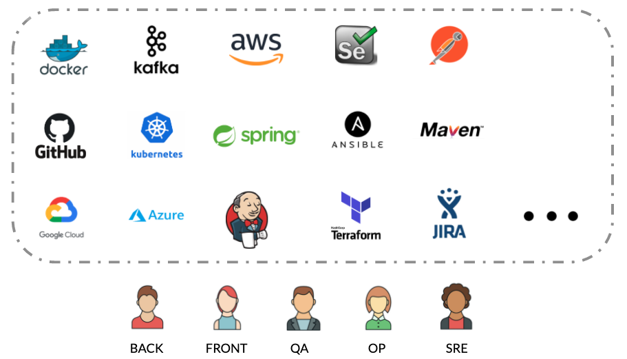

# Overview

## What is Ritchie?

Ritchie is a **CLI** \(Command Line Interface\) which allows to **create**, **store** and **share** automation efficiently and securely with a team or with the whole community. 

## What does Ritchie do?

The tool allows you to create formulas that, in other terms represent programs and/or commands that will facilitate your daily programming work. Ritchie works as a single formulas repository.

Check out the video below to see how our project works: 



## Installation

Ritchie is a **cross-plataform** CLI. For more information on how to install, just choose your operating system below:







### **Programming Languages**


Ritchie has been developed using the **Golang** language. 


However, formulas can be written using **any programming language**.

### Tools


Ritchie works with **any tool** you could use for automations.


## **How does Ritchie work?**


The tool allows you to create **formulas** that, in other terms, represent programs and /or commands that will facilitate the daily programming work.


In general, the common process for executing a project is to create a whole previous infrastructure, defining a language in the system that will be programmed, downloading dependencies and defining the rules that should be used for the project.

**With Ritchie**, it's possible to define this configuration using a formula, creating this infrastructure directly by a command line, which in this case will delivered all the structure of the project with all files automatically configured. That helps on avoiding an important time spent on infrastructure and configurations.

## **What makes Ritchie unique ?**

Because it is a CLI tool, Ritchie seeks to improve the operational **developers'** **experience and brings beneficial such as:**

* Simplify repetitive ****and easy-to-execute tasks
* reduce the rework 
* Promote more time for the development team to focus on their deliveries.

So, instead of writing down on the command lines which parameters and / or arguments the user needs to inform, we do the opposite: Ritchie presents the available options and goes, line by line, asking for the information needed for the command to work, in an interactive way.

In the example below, we have the execution of a scaffold command with the coffee formula. As the user signals which formula he wants to use, the system automatically passes, line by line, asking which specific parameters must be considered to perform the desired action.  

