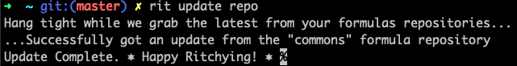
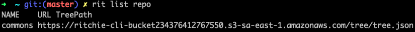

# Repositórios


Quando um usuário baixa o Ritchie, ele apenas terá acesso aos comandos core.

O comando**`rit add repo`** permite ao usuário de adicionar os comandos das fórmulas de um repositório específico à árvore local do CLI.


## Adicione o repositório _Commons_

**As fórmulas da comunidade** estão armazenadas dentro do projeto [**ritchie-formulas**](https://github.com/ZupIT/ritchie-formulas) no **GitHub**. Os comandos dessas fórmulas não aparecerão no helper do Ritchie executando o comando `rit --help` enquanto o usuário não importará o tree.json do repositório.

O **tree.json** do repositório ritchie-formulas pode ser importando através da seguinte url :

```text
http://ritchie-cli-bucket152849730126474.s3-website-sa-east-1.amazonaws.com/tree/tree.json
```

Esse passo deve ser informado quando executar o comando `rit add repo` para ser adicionado à árvore local do CLI. 


Depois de adicionar o tree.json do novo repositório, os comandos executáveis das fórmulas são adicionadas ao _helper_ do Ritchie. Isso significa que eles estão agora disponíveis para o usuário.

Ao adicionar um novo repositório, o usuário também pode escolher a prioridade do repositório em relação aos demais, dando prioridade às fórmulas desse repositório em vez de fórmulas que usam o mesmo comando executável em outro repositório. Dessa forma, quando a CLI criar a árvore principal, não permitirá nenhum comando duplicado, sempre mantendo aquele com a prioridade mais alta.


No momento é necessário adicionar esse repositório em ambas versões do Ritchie. Está planejado incluir esse repositório automaticamente na versão Single no futuro.


## **Adicione outro** repositório

Para adicionar outro repositório ao CLI, é possível seguir o mesmo processo descrito acima, exceto que é necessário ter o tree.json desse repositório armazenado em algum lugar para o Ritchie importá-lo da mesma maneira que foi feito para o projeto [**ritchie-formulas**](https://github.com/ZupIT/ritchie-formulas).

## **Atualizar um** repositório

É possível atualizar todos os repositórios depois de configurados, usando o comando `rit update repo`. Esse comando atualizará os repositórios tree.json a partir da URL informada na adição dos repositórios.



## **Remover** um repositório

É possível remover do CLI a árvore de um repositório  usando o comando `rit delete repo`. O usuário precisará informar o nome que ele usou quando adicionou o repositório. 

É possível verificar o nome dos repositórios atuais usando o comando `rit list repo`.




## **Limpar** um repositório

O comando `rit clean repo` permite ao usuário remover o cache do repositório informado. Dessa forma, os comandos associados não aparecerão no preenchimento automático até importar o tree.json deste repositório novamente, a próxima vez que o usuário executar uma das fórmulas do repositório.

