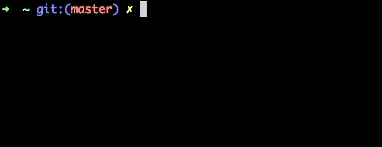

# Criando fórmulas

## Introdução 

O processo para criar uma fórmula é feito através do comando **`rit create formula`**. Ele cria a estrutura necessária para o usuário começar a desenvolver uma nova fórmula em sua máquina local.


Antes de seguir as etapas para criar uma fórmula, é recomendável ter o Ritchie **instalado** e **testado** corretamente para garantir que todos os comandos estejam funcionando.


## Passo 1: Criação da fórmula

Quando o comando **`rit create formula`** é executado no terminal, algumas informações são solicitadas ao usuário:

1. o **`novo comando`** de fórmula

O ideal é seguir o padrão `rit + grupo + verbo + substantivo`.

2. a **`linguagem`** de programação da nova fórmula

Um modelo Hello World será criado neste idioma.

3. o **`espaço de trabalho (path)`** onde a nova fórmula será adicionada

Pode ser um espaço de trabalho de fórmula existente. Se não houver nenhum disponível, um espaço de trabalho padrão da fórmula será criado automaticamente, denominado **`ritchie-formulas-local`** na **`HOME`** da máquina do usuário.

O comando **`rit create formula`** também cria a fórmula automaticamente \(gera os arquivos executáveis da fórmula e os adiciona à [pasta .rit](https://docs.ritchiecli.io/v/doc-portuguese/referencia/cli#o-que-compoe-a-pasta-rit)\).

Isso significa que é possível executar o novo comando diretamente após sua criação. Nesse caso, o modelo da fórmula Hello World será executado como mostrado abaixo:

Atualmente, este modelo do Hello World é composto por 3 parâmetros de entrada:

1. uma ****variável de **`texto`**
2. uma **`lista`** de variáveis de texto
3. uma variável **`booleana`** 

Esses representam os três tipos de entradas disponíveis atualmente ao usar o Ritchie.

## Passo 2: Estrutura da fórmula

Todas as áreas de trabalho de fórmulas do Ritchie seguem a mesma arquitetura. Você pode encontrar mais informações [na seção de fórmulas](https://docs.ritchiecli.io/v/doc-portuguese/referencia/formulas).

Ao executar o comando **`rit create formula`**, a nova fórmula é adicionada ao espaço de trabalho informado, atualizando automaticamente a estrutura do espaço de trabalho com os arquivos de modelo do Hello World.

## Passo 3: I**mplementação da fórmula**

Com a nova estrutura de fórmula gerada com sucesso dentro da área de trabalho escolhida, é possível começar a implementar a nova automação, atualizando o modelo Hello World.

Para implementar a operação desejada, é necessário atualizar 3 arquivos localizados dentro do pacote / src da pasta raiz da nova fórmula:

1. O arquivo **`config.json`**, para configurar as entradas da fórmula.
2. O arquivo **`main`** \(geralmente usado para extrair essas entradas\)
3. Os arquivos na **`pasta / pkg`**.

_Observação: Dependendo do idioma escolhido, pode ser necessário atualizar mais arquivos, por exemplo, para manipular dependências._


Algumas outras instruções:

❗Não altere o nome das pastas raiz da fórmula \(grupo / verbo / substantivo\) sem atualizar o tree.json e o **Makefile** \(da área de trabalho\) com os caminhos apropriados.

❗O **tree.json** e o **Makefile** \(do repositório\) já foram criados / atualizados executando o comando rit create formula. Conseqüentemente, você não precisará alterá-las para poder testar a nova fórmula, mesmo depois de alterar os arquivos comentados acima.


## Passo 4: Testar a nova implementação da fórmula

Após a implementação da nova automação, é necessário executar o comando **`rit build formula`** para atualizar os arquivos executáveis da fórmula que foram gerados em sua criação.

Quando o comando rit build formula é executado no terminal, algumas informações são solicitadas ao usuário:

1. o **`espaço de trabalho (path)`** em que a fórmula foi implementada 
2. o **`caminho`** para o pacote formula /src \(**`grupo / verbo / substantivo`**, se esse padrão tiver sido seguido\)

É isso aí ! Após criar com êxito a fórmula, é possível executar o comando da fórmula novamente para ver a execução da implementação atualizada.


_**Nota**: o comando **`rit build formula`** também pode ser usado com uma flag **`--watch`**_

_Usando esse sinalizador, o comando “vigia” automaticamente o pacote **/ src** da fórmula especificada e atualiza os arquivos executáveis da fórmula se alguma alteração for salva pelo usuário._


