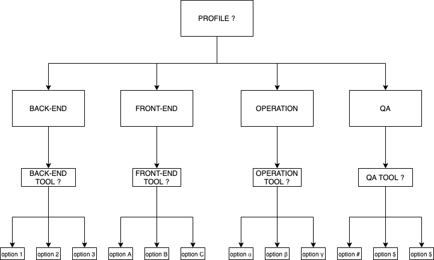

# Level 3: Conditional Inputs

## Objective

Create a formula on Ritchie that will **return the tool selected by the user according to its profile**.


Command suggestion: **`rit get tools`**


To do so, you'll have to use the **conditional field** as explained on the [**config.json file section**](https://docs.ritchiecli.io/how-to/implement-a-formula#1-config-json).

## Inputs

This formula needs to contain \(at least\) those two inputs parameters:

* [ ] Profile \(`PROFILE`\). 
* [ ] Profile tool \(`TOOL`\).

The formula inputs will have to respect the diagram below:

## Step by step

The formula needs to follow the next steps:

1. Extract all inputs parameters. 
2. Return the selected profile on the terminal. 
3. Return the selected tool on the terminal.

## Improvement suggestions

 If you want to play a little more, here are some suggestions:

* [ ] Install the selected tool according to the computer OS.

## Next steps 

👉 If you've completed the third challenge, let's go to the [**level 4 task**](level-3.md)!

