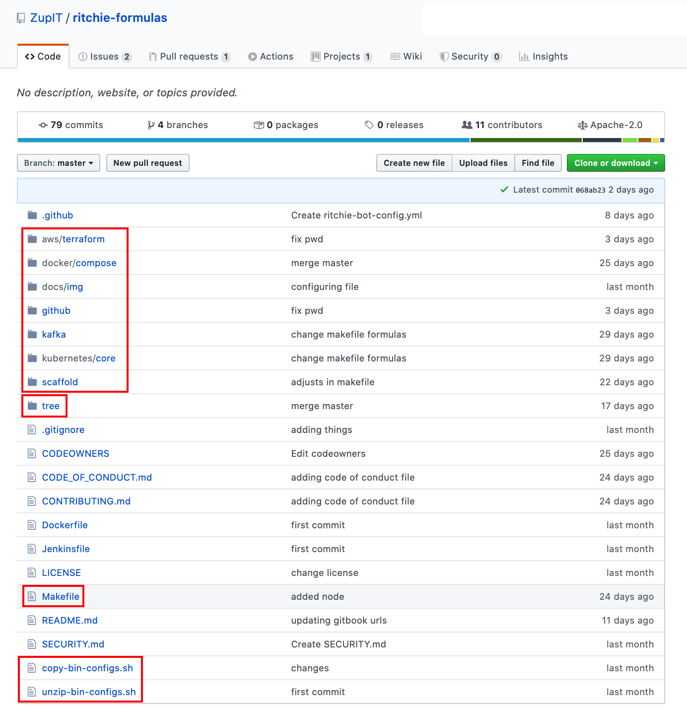

# Formulas

## Structure 

### Formula composition


Each formula is composed of several files allowing its execution by the CLI.


For a formula to be executed by the terminal, it is necessary to have: 

* The tree.json file of the repository where the configured formula is located 
* A config.json file 
* An executable file

The **tree.json** file allows the CLI to know the commands and sub-commands associated with the formula. This is how it identifies where to download the formula files on the first execution \(on demand\).

The **config.json** file contains the formula's input parameters. It allows the CLI to know what datas to ask the user when he executes the command in the terminal in order to process the formula correctly.

The **executable file** contains the implementation of the formula. The CLI will download this file according to the operating system of the user's computer and execute this formula sending the input parameters that have been informed.

## Formula repositories


Formulas are stored in **formula repositories**. 

These repositories need to have a particular structure.


Each repository must contain the following elements: 

* the formula folders. 
* a tree folder 
* a Makefile file 
* a copy-bin-configs.sh file 
* an unzip-bin-configs.sh file

Each **formula folder** will contain the executable code and files for a formula.

The **tree** folder is composed of a **tree.json** file that will contain the command tree of all formulas in the repository.

The **Makefile** file contains a reference to all formulas in the repository, as well as an executable command manipulating the files **copy-bin-configs.sh** and **unzip-bin-configs.sh**, in order to generate the executable files needed to test the formula\(s\) locally inside the [.rit folder](../cli/.rit-folder.md).

### 

