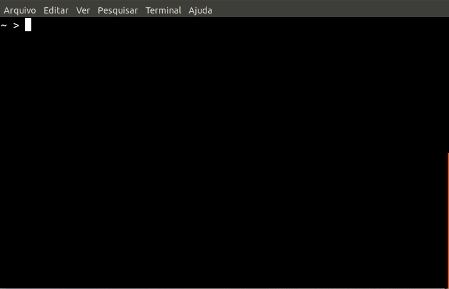

# Run formula "hello-world"

After you finished the previous steps - [**installation**](installation/) and [**initialization**](initialization.md) -, you can run a "hello-world" formula to test Ritchie. 

As most of developers like coffee, we have created an initial formula that "delivers coffee" to you. 

```text
$ rit scaffold generate coffee-go
```

See how the magic works: 




