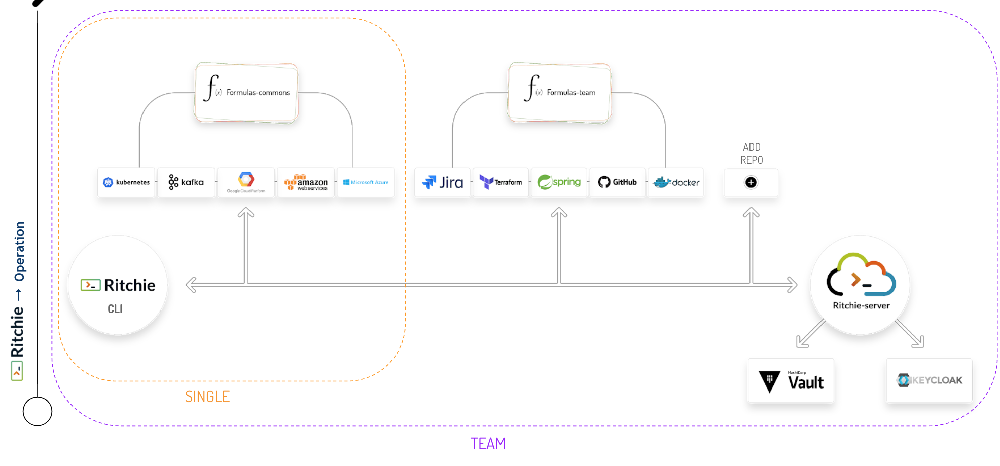

# Choosing a version

## Intro

Antes de começar a usar o Ritchie, é preciso optar por uma das versões disponíveis do nosso CLI:

* **Versão Single:** indicada para profissionais autônomos;
* **Versão Team:** indicada para equipes ou profissionais de uma corporação.

As duas versões foram criadas para atender às diferentes necessidades de analistas de infraestrutura, SREs, arquitetos ou engenheiros de software.

Na prática, a principal diferença entre as versões está no uso \(ou não\) de um servidor para armazenamento das **fórmulas**, obrigatório para quem utiliza a Versão Team, já que, no caso de quem utilizar o Ritchie para projetos corporativos, é necessário garantir segurança da informação para proteção de dados sensíveis.  

## **Single version**

The main characteristics of this version are:

* Formulas access developed by the community.
* The possibility to test new formulas on a local repository.
* Encrypted information on your local machine.

### Repositories

If you choose the **Single Version,** you are able to access ****two repositories:

1. [**ritchie-cli**](https://github.com/ZupIT/ritchie-cli): this repository contains the core of the tool.  
2. [**ritchie-formulas**](https://github.com/ZupIT/ritchie-formulas): ****this repository contains the formulas shared with the community that every Ritchie user can access, update and execute through the terminal.

## Team version

The main characteristics of this version are: 

* Access the developed formula in the community and also the formulas on the server team;
* The possibility to test new formulas on a local repository; 
* Encrypted information on your local machine.

### Repositories 

With the **Team Version** is possible to access more repositories: 

1. [**ritchie-cli**](https://github.com/ZupIT/ritchie-cli): this repository contains the core of the tool.  
2. \*\*\*\*[**ritchie-formulas**](https://github.com/ZupIT/ritchie-formulas): this repository contains the formulas shared with the community that every Ritchie user can access, update and execute through the terminal. 
3. \*\*\*\*[**ritchie-server**](https://github.com/ZupIT/ritchie-server): This repository contains the integrations with the platforms [Keycloak](https://www.keycloak.org/) & [Vault](https://www.vaultproject.io/), used to create the session and store datas securely.


It is also possible to store your team specific formulas in **other repositories**, and access them through [the login command](https://docs.ritchiecli.io/software-architecture-1/security#login-command).


