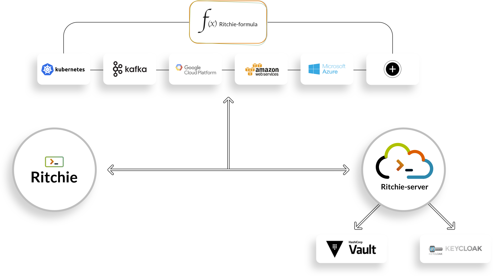

# Team Version

The **Team Version** is composed of **at least** three repositories :

1. [**ritchie-cli**](https://github.com/ZupIT/ritchie-cli): this repository contains the core of the tool.  
2. \*\*\*\*[**ritchie-formulas**](https://github.com/ZupIT/ritchie-formulas): this repository contains the formulas shared with the community that every Ritchie user can access, update and execute through the terminal. 
3. \*\*\*\*[**ritchie-server**](https://github.com/ZupIT/ritchie-server): This repository contains the integrations with the platforms [Keycloak](https://www.keycloak.org/) & [Vault](https://www.vaultproject.io/), used to create the session and store datas securely.


It is also possible to store your team specific formulas in **other repositories**, and access them through [the login command](https://docs.ritchiecli.io/software-architecture-1/security#login-command).


