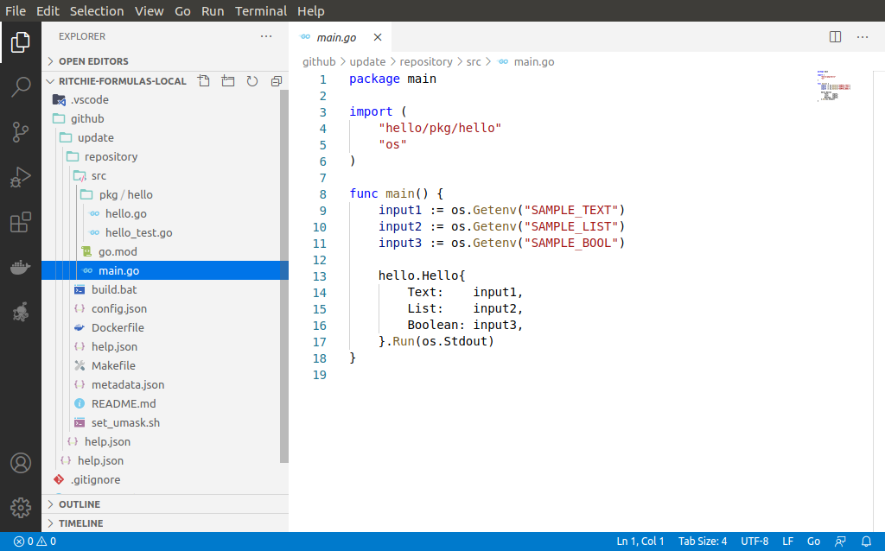

# How to implement a formula

## How to implement? 

Once you [**create and test your formula**](how-to-create-formulas.md), Ritchie will generate a structure of files inside your workspace. Then, you can start implementing the new automation by updating this "Hello World template.

### Editable files 

To do this configuration, you hill have to update **3 files** located inside the **/src package** of the new formula’s root folder. 

#### 1.  **`config.json`**

The **config.json** file contains the formula's input parameters. It allows the CLI to know what datas to ask the user when he executes the command in the terminal in order to process the formula correctly.

These input parameters are made up of the following fields: a description and the formula inputs parameters.

Other information available on this file:

* Name 
* Type
* Label 
* Default \(optional\) 
* Items \(optional\) 
* Cache \(optional\)

#### 2. **`main file`**

The main.file is generally used to extract the inputs asked with the config.json file, and then call one or more methods to realise an operation \(the task / automation\) using those input parameters.  

#### 3. `/pkg folder`

This folder contains the files with the formula's behavior. Methods called by the main.file are located inside the files inside this folder.


Depending on the chosen language, it may be necessary to update more files, for example to manipulate dependencies.


See an example below of this structure \(in this case, it's a formula created in Golang\):

As the image above, you can see the editable files:

* **pkg/\*:** change the formula's behavior.
* **main.go:** change the inputs, the order of requests and the formula's function name \(indicated on pkg\).
* **config.json:** change the inputs.
* **help.json:** change the help message according to the command's level.

The files and those respective structures define the command, so it's not indicated to change its names or include more files/folders that are not in the src folder.

## What is the formula composition?


Each formula is composed of several files allowing its execution by the CLI.


For a formula to be executed by the terminal, it is necessary to have: 

* The **tree.json** file of the repository where the configured formula is located 
* An **executable file**
* \*\*\*\*[**A config.json file**](implement-a-formula.md#1-config-json), as mentioned above.

The **tree.json** file allows the CLI to know the commands and sub-commands associated with the formula. This is how it identifies where to download the formula files on the first execution \(on demand\).

The **executable file** contains the implementation of the formula. The CLI will download this file according to the operating system of the user's computer and execute this formula sending the input parameters that have been informed.

## Next steps 

On this section, you saw how to implement a formula on Ritchie. To keep configuring the formula: 

👉 Go to [**build a formula**](build-a-formula.md) to see how to continue the tests on the formulas you create. 

👉 Go to [**publish a formula**](how-to-publish-a-formula.md) to see how to transfer your work to a public repository. 

