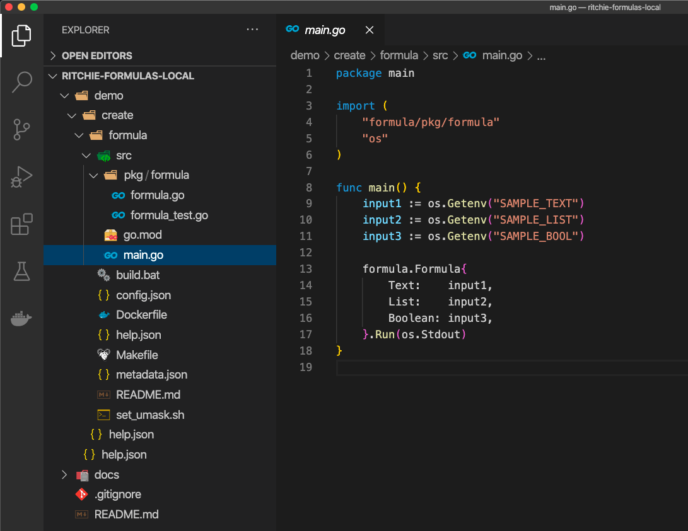
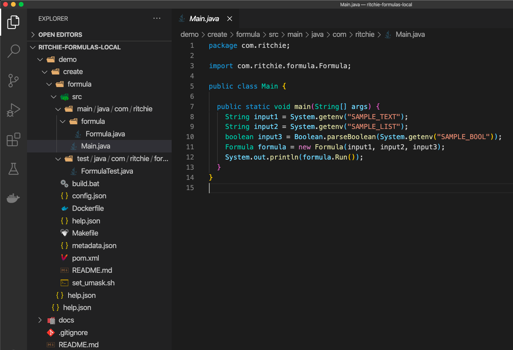
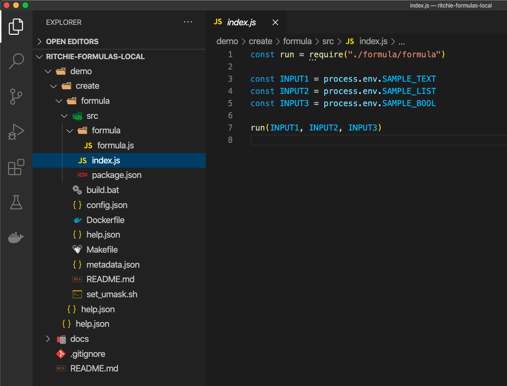
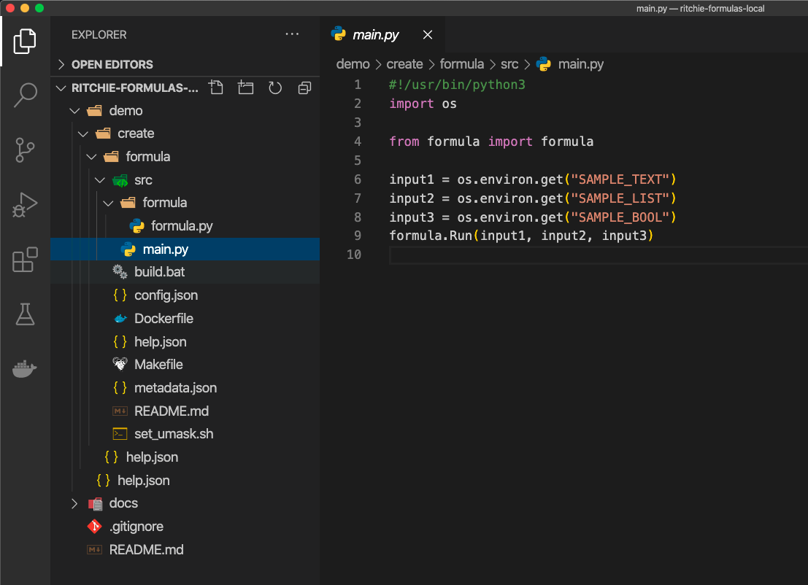
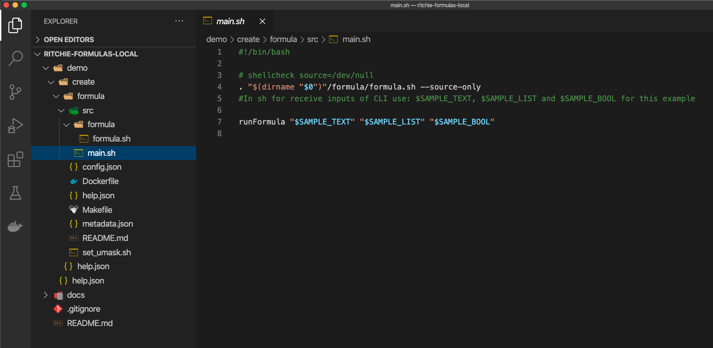

# How to implement formulas

## How to implement? 

Once you have [**created and tested your formula**](how-to-create-formulas.md), Ritchie will generate a local workspace. This is where you can start implementing the new automation by updating the **Hello World** template.

### Editable files 

To do this configuration, you will have to update **3 files** located inside the **/src package** of the new formula’s root folder. 

#### 1.  **`config.json`**

The **config.json** file contains the formula's input parameters. It allows the CLI to know what datas to ask the user when he executes the command in the terminal in order to process the formula correctly.

These input parameters are made up of the following fields: 

* a docker image builder
* the formula inputs parameters.

Each input is composed of the following fields:

* `name`: variable name to extract. 
* `type`: _**text**_ \(string\), _**bool**_ \(boolean\), _**password**_ \(hidden string\) or [_**credentials**_](https://docs.ritchiecli.io/how-to/manipulate-credentials#how-to-use-credentials-as-formula-inputs). 
* `label` : text appearing on the CLI asking for the input. 
* `default` \(_optional_\): default input value \(if null\). 
* `items` \(_optional_\): list of input variable options. 
* `cache` \(_optional_\): 
  * `active`: if cache is enabled or not.
  * `qty`: amount of values to store.
  * `newLabel`: text appearing on the CLI asking for a new input. 
* `condition` \(_optional_\): Only shows this input if the given condition succeeds
  * `variable`: The variable name used on a previous input for comparison.
  * `operator`: A logical operator to compare. Supports **`==`**, **`!=`**, **`<`**, **`>`**, **`<=`**, and **`>=`.**
  * `value`: The desired value to compare to.

#### 2. **`main file`**

* This file is used to extract the inputs asked in the config.json file.  _Inputs are extracted by the field **name** informed on the config.json file._ 
* This is also where the methods are called to perform the task / automation of the formula, manipulating the input parameters. 

#### 3. `formula/* folder`

This folder contains the files with the formula's behavior. Methods called by the main.file are located inside the files inside this folder.


Depending on the chosen language, it may be necessary to update more files, for example to manipulate dependencies.


### Examples




According to the image above, you can see the editable files:

* **config.json:** Update the inputs configurations.
* **main.go:** Extract the inputs and call the formula's methods \(coded on **formula/\***\).
* **formula/\*:** Code the formula's behavior.
* **help.json:** Update the command or subcommand description message.




According to the image above, you can see the editable files:

* **config.json:** Update the inputs configurations.
* **main.java:** Extract the inputs and call the formula's methods \(coded on **formula/\***\).
* **formula/\*:** Code the formula's behavior.
* **help.json:** Update the command or subcommand description message.




According to the image above, you can see the editable files:

* **config.json:** Update the inputs configurations.
* **index.js:** Extract the inputs and call the formula's methods \(coded on **formula/\***\).
* **formula/\*:** Code the formula's behavior.
* **help.json:** Update the command or subcommand description message.




According to the image above, you can see the editable files:

* **config.json:** Update the inputs configurations.
* **main.py:** Extract the inputs and call the formula's methods \(coded on **formula/\***\).
* **formula/\*:** Code the formula's behavior.
* **help.json:** Update the command or subcommand description message.




According to the image above, you can see the editable files:

* **config.json:** Update the inputs configurations.
* **main.sh:** Extract the inputs and call the formula's methods \(coded on **formula/\***\).
* **formula/\*:** Code the formula's behavior.
* **help.json:** Update the command or subcommand description message.




The structures defines the command, so **it's not indicated to update** folders names or include more files/folders **if not** in the **src/\*** folder.


## Next steps 

On this section, you saw how to implement a formula on Ritchie. To keep configuring the formula: 

👉 Go to [**build a formula**](build-a-formula.md) to see how to continue the tests on the formulas you create. 

👉 Go to [**publish a formula**](how-to-publish-a-formula.md) to see how to transfer your work to a public repository. 

