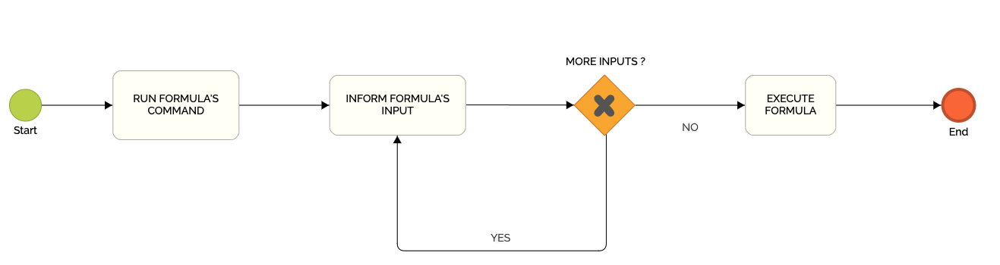

# Key Concepts

## Formulas

**Formulas** are nothing more than **automations**. That is, they are codes called through command lines to perform some operation. 

## **Formulas execution**


Formulas are executed after running command lines on the terminal.


Depending on the formula, the user might need to inform input parameters.  
  
Those input parameters can be informed in different ways:

* After running the command on the terminal \(via **prompt**\) 
* When typing the command on the terminal \(via **stdin**\) 
* During the execution of the formula \(if coded using **prompt**\)

## Running a formula \(with prompt\)

**`rit demo hello-world`** is an executable command associated with a formula in the CLI's tree.

After executing the command, Ritchie asked the user for some datas: 

* Name
* If you have ever used Ritchie 
* Type of automation

Those datas are the **input** **parameters** of the formula.

Once these parameters were informed, the formula was successfully executed \(according to what the logs presented\).

## Command Tree


Commands used in Ritchie are grouped according to a **tree**.   
  
****It is important to know this concept in order to actually understand the structure of the product.


In the case of Ritchie, the **Cobra** \(a Golang library\) pattern was followed using the following logic of building core commands:

                                                 **RIT + VERB + NOUN**

To allow more options and freedom for users, it is also allowed to follow the pattern below in the construction of formula commands:

                                        **RIT + GROUP + VERB + NOUN**

The app name is Ritchie, so we use the name **rit** to start our command tree.

The **rit** command is therefore our parent command, or **root**. It is not executable \(it means that it will not start any operations if you use it alone in the terminal\). It is necessary to use executable sub-commands \(which are child commands, or branches, of the rit command\) in order to start any process.

The executable commands in Ritchie are the commands located at the last level of the tree.  
  
****For example, in the image above: 

* The **rit set context** command is executable, as it is at the last level of the tree. 
* The **rit kafka create** command is not executable as there is an executable **topic** subcommand, at the last level of the tree.

This command tree concept is the **core** of Ritchie's structure.   
All commands and sub-commands are mapped in a tree dynamically created according to the repositories the user added locally on his computer by using the **`rit add repo`** command.

