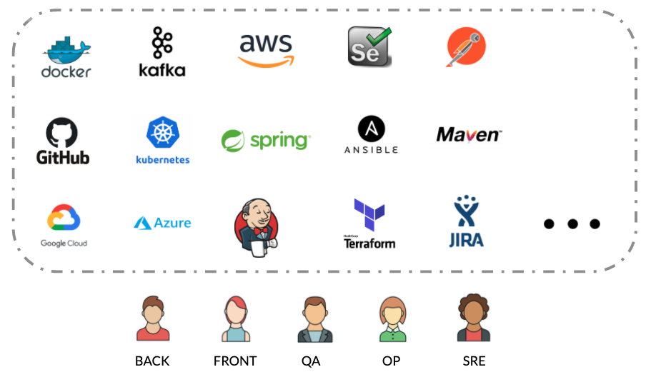

# Key Concepts


Let's assume you're familiar with **CLI**, **DevOps**, **NoOps** and **automations** concepts.


## Operating System


Ritchie is a **cross-platform** CLI.


## **Programming Languages**


Ritchie has been developed using the **Golang** language. 


However, formulas can be written using **any programming language**.

## Tools


Ritchie works with **any tool** you could use for automations.


## **Command Tree**


Commands used in Ritchie are grouped according to a **tree**.   
  
****It is important to know this concept in order to actually understand the structure of the product.


In the case of Ritchie, the **Cobra** \(a Golang library\) pattern was followed using the following logic of building core commands:

                                                 **RIT + VERB + NOUN**

To allow more options and freedom for users, it is also allowed to follow the pattern below in the construction of formula commands:

                                        **RIT + GROUP + VERB + NOUN**

The app name is Ritchie, so we use the name **rit** to start our command tree.

The **rit** command is therefore our parent command, or **root**. It is not executable \(it means that it will not start any operations if you use it alone in the terminal\). It is necessary to use executable sub-commands \(which are child commands, or branches, of the rit command\) in order to start any process.

The executable commands in Ritchie are the commands located at the last level of the tree.  
  
****For example, in the image above: 

* The **rit set context** command is executable, as it is at the last level of the tree. 
* The **rit kafka create** command is not executable as there is an executable **topic** subcommand, at the last level of the tree.

This command tree concept is the **core** of Ritchie's structure. All commands and sub-commands are mapped into a json that is updated or created when you download or update the CLI on your computer.  
****

## Repositories

Today, Ritchie is composed of 3 repositories on Github.

1. The **ritchie-cli** \(open source\) repository that contains the core CLI commands that have priority over the commands of the other operations. 
2. The **ritchie-formulas** \(open source\) repository that contains commons formula commands  that are shared with all Ritchie users. 
3. The **ritchie-server** \(open source\) repository that contains the integrations with the **Vault** and **Keycloak**, necessary for the operation of the _Team_ version of the CLI.

Organizational repositories \(used in the _Team_ version\) should ideally follow the following nomenclature: **ritchie-formulas-teamName** \(private / open source\) that contains the commands specific to the team's formulas.  


Each formulas repository will have its own command tree, in a file called tree.json


When a user is going to download Ritchie, or perform the **rit login** command to access an organization's repository \(_Team_ version\), the CLI merges the tree.json of the formulas repositories to which he has access.

The repository trees merge will be the tree of all commands available via the CLI on the user's computer.

Moreover, there is a concept of **priority** between the repository trees, to avoid repetitive commands after joining all the commands in the CLI's tree.

Here is the **default priority** defined in the CLI among the repositories:

* Priority 0: Core 
* Priority 1: Location 
* Priority 2: Other repositories

This rule allows each user \(_single_\) / organization \(team\) to define the priority among the other repositories.

For example, it is possible for a user to choose between the 2 scenarios below:

In **scenario 1**, priority would be given to commons commands over your team's commands.

In **scenario 2**, priority would be given to team commands over commons commands. This would allow, for example, a user / team to use a command that is in the **ritchie-formulas** \(commons\) repository tree for a formula in their repository, performing a different operation with the same command, since it would have priority.

For more informations, check the [repositories section](https://docs.ritchiecli.io/software-architecture/repositories).

## **Formulas**


As explained earlier, formulas are nothing more than automations. That is, they are codes called through the command lines to perform some operation. 


After implementing a formula, a binary / script is generated for each operating system \(Linux, MacOs or Windows\). This binary / script contains the code needed to execute the formula. 

The first time the user executes the command associated with a formula on the terminal, the formula's binary / script is downloaded according to the operating system installed on his computer. 

In addition to this binary / script, it is necessary to download a json file associated with the formula, which contains the **input parameters** necessary for the code implemented in the binary / script to be executed. These input parameters will be informed by the user after he enters the command in the terminal, before actually executing the formula.  
****

**Rit scaffold generate coffee** is an executable command associated with a formula in the CLI's tree.

As it was the first time that the command was executed, it is possible to observe that Ritchie downloaded a config file and the formula's binary in sequence.

After downloading the files, Ritchie asked the user for some datas: name, type of coffee & delivery.

Those datas are the **input** **parameters** of the formula.

Once these parameters were informed, the formula was successfully executed \(according to what the logs presented\).

