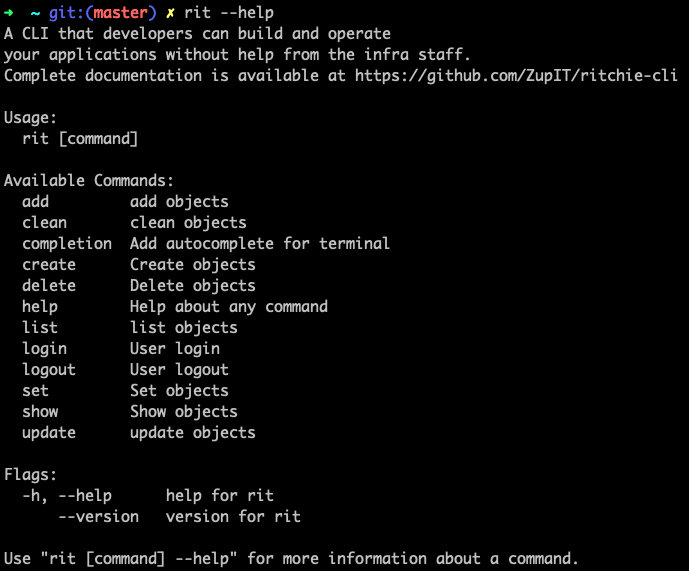

# Comandos

Os comandos do core do Ritchie são executados usando **rit** + **verbo** + **substantivo**

<table>
  <thead>
    <tr>
      <th style="text-align:left">Comando Core</th>
      <th style="text-align:left">Opera&#xE7;&#xE3;o</th>
    </tr>
  </thead>
  <tbody>
    <tr>
      <td style="text-align:left"><a href="https://docs.ritchiecli.io/v/doc-portuguese/arquitetura-do-sistema/repositorios#adicione-o-repositorio-commons">rit add repo</a>
      </td>
      <td style="text-align:left">adiciona a &#xE1;rvore de um novo reposit&#xF3;rio
         (para ter acesso as f&#xF3;rmulas desse reposit&#xF3;rio com Ritchie)</td>
    </tr>
    <tr>
      <td style="text-align:left"><a href="https://docs.ritchiecli.io/v/doc-portuguese/arquitetura-do-sistema/repositorios#limpar-um-repositorio">rit clean repo</a>
      </td>
      <td style="text-align:left">limpa o cache de um reposit&#xF3;rio</td>
    </tr>
    <tr>
      <td style="text-align:left">rit completion zsh</td>
      <td style="text-align:left">adiciona o <em>autocomplete</em> via zsh</td>
    </tr>
    <tr>
      <td style="text-align:left">rit completion bash</td>
      <td style="text-align:left">adiciona o <em>autocomplete</em> via bash</td>
    </tr>
    <tr>
      <td style="text-align:left"><a href="https://codelabs-preview.appspot.com/?file_id=1N2DNIJTH38SrLIn63t0WOwcWDfYDg1p60EBJ-mnHdmU#0">rit create formula</a>
      </td>
      <td style="text-align:left">
        
cria uma nova f&#xF3;rmula

        
(assim que um novo reposit&#xF3;rio local para teste)

      </td>
    </tr>
    <tr>
      <td style="text-align:left">rit create user</td>
      <td style="text-align:left">cria um novo usu&#xE1;rio (padr&#xE3;o) na organiza&#xE7;&#xE3;o
         (s&#xF3; dispon&#xED;vel para <em>admin</em> da organiza&#xE7;&#xE3;o na <b>vers&#xE3;o</b>  <b>Team</b>)</td>
    </tr>
    <tr>
      <td style="text-align:left"><a href="https://docs.ritchiecli.io/v/doc-portuguese/arquitetura-do-sistema/repositorios#remover-um-repositorio">rit delete repo</a>
      </td>
      <td style="text-align:left">remove a &#xE1;rvore de um reposit&#xF3;rio
         (para remover o acesso as f&#xF3;rmulas desse reposit&#xF3;rio com Ritchie)</td>
    </tr>
    <tr>
      <td style="text-align:left">rit delete user</td>
      <td style="text-align:left">
        
remove um usu&#xE1;rio de uma organiza&#xE7;&#xE3;o

        
(s&#xF3; dispon&#xED;vel para <em>admin</em> da organiza&#xE7;&#xE3;o na <b>vers&#xE3;o</b>  <b>Team</b>)

      </td>
    </tr>
    <tr>
      <td style="text-align:left"><a href="https://docs.ritchiecli.io/v/doc-portuguese/primeiros-passos/primeiros-comandos#context">rit delete context</a>
      </td>
      <td style="text-align:left">remove um contexto da sess&#xE3;o</td>
    </tr>
    <tr>
      <td style="text-align:left"><a href="https://docs.ritchiecli.io/v/doc-portuguese/arquitetura-do-sistema/repositorios#remover-um-repositorio">rit list repo</a>
      </td>
      <td style="text-align:left">lista todos os reposit&#xF3;rios que o Ritchie tem acesso no computador</td>
    </tr>
    <tr>
      <td style="text-align:left"><a href="https://docs.ritchiecli.io/v/doc-portuguese/arquitetura-do-sistema/login#comando-do-login">rit login</a>
      </td>
      <td style="text-align:left">efetua o login para um time (criando uma sess&#xE3;o)</td>
    </tr>
    <tr>
      <td style="text-align:left"><a href="https://docs.ritchiecli.io/v/doc-portuguese/arquitetura-do-sistema/login#comando-do-login">rit logout</a>
      </td>
      <td style="text-align:left">encerra a sess&#xE3;o do usu&#xE1;rio</td>
    </tr>
    <tr>
      <td style="text-align:left"><a href="https://docs.ritchiecli.io/v/doc-portuguese/arquitetura-do-sistema/login#credenciais">rit set credential</a>
      </td>
      <td style="text-align:left">configura credenciais na sess&#xE3;o</td>
    </tr>
    <tr>
      <td style="text-align:left"><a href="https://docs.ritchiecli.io/v/doc-portuguese/primeiros-passos/primeiros-comandos#context">rit set context</a>
      </td>
      <td style="text-align:left">configura um novo contexto na sess&#xE3;o</td>
    </tr>
    <tr>
      <td style="text-align:left">rit set server</td>
      <td style="text-align:left">configura a URL do servidor do time (<b>vers&#xE3;o Team</b>)</td>
    </tr>
    <tr>
      <td style="text-align:left"><a href="https://docs.ritchiecli.io/v/doc-portuguese/primeiros-passos/primeiros-comandos#context">rit show context</a>
      </td>
      <td style="text-align:left">mostra o contexto usado na sess&#xE3;o atual</td>
    </tr>
    <tr>
      <td style="text-align:left"><a href="https://docs.ritchiecli.io/v/doc-portuguese/arquitetura-do-sistema/repositorios#atualizar-um-repositorio">rit update repo</a>
      </td>
      <td style="text-align:left">atualiza as &#xE1;rvores de todos os reposit&#xF3;rios
         (para acessar as novas f&#xF3;rmulas desses reposit&#xF3;rios com Ritchie)</td>
    </tr>
  </tbody>
</table>

| Flags | Operation |
| :--- | :--- |
| rit --help | Ajuda com os comandos do Ritchie |
| rit --version | Retorna a versão do Ritchie usada no computador |

