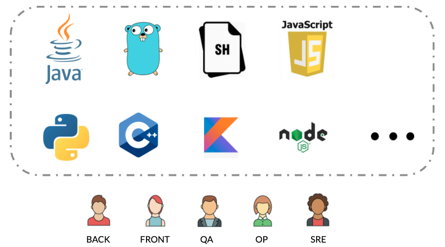
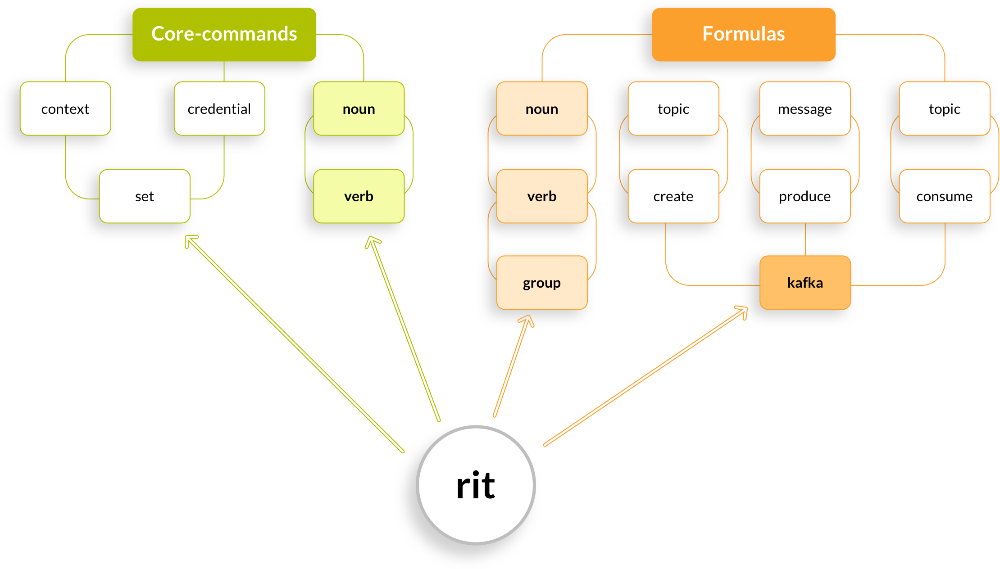
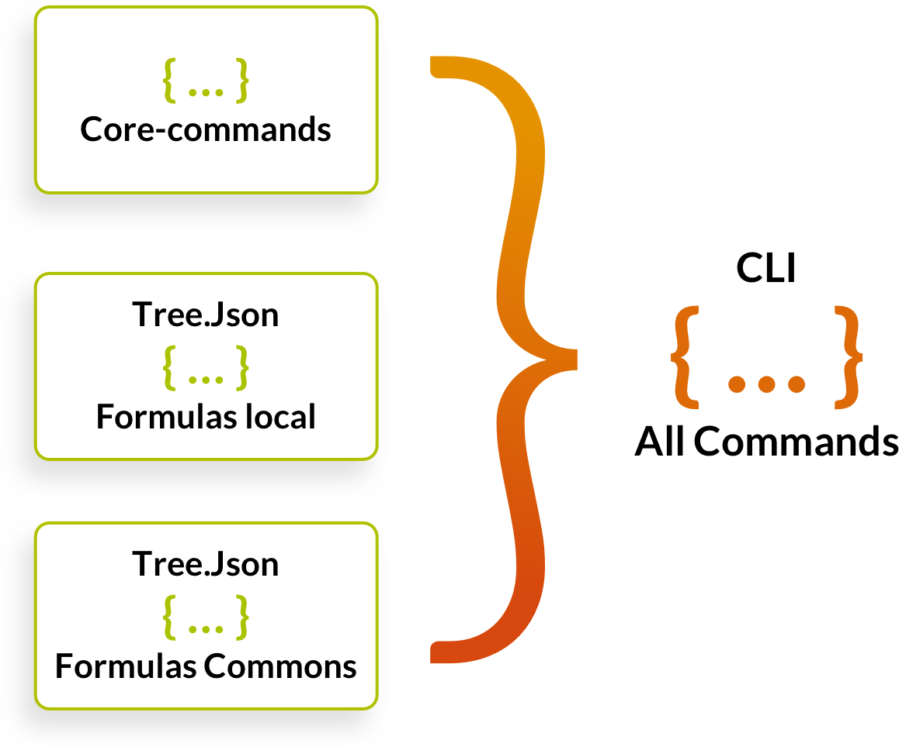
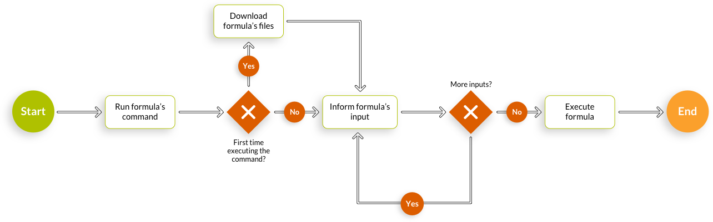

# Principais Conceitos


Vamos supor que você esteja familiarizado com os conceitos de CLI, DevOps, NoOps e automações.


## Sistemas Operacionais


Ritchie é um CLI que funciona para **todos os sistemas operacionais**


## **Linguagens de programação**


Ritchie foi desenvolvido usando a linguagem do Google : **Golang**


No entanto, as fórmulas podem ser escritas usando qualquer linguagem de programação.

## Tools


Ritchie works with **any tool** you could use for automations.


## **Árvore de comandos**


Primeiro, é importante conhecer esse conceito para de fato poder entender a estrutura do produto em si : Os comandos usados no Ritchie são agrupados conforme uma árvore. 


No caso do Ritchie, foi seguido o padrão do **Cobra** \(uma biblioteca da linguagem Golang\) usando a seguinte lógica de construção de comandos **core** :

                                                 **RIT + VERBO + SUBSTANTIVO**

E, para permitir mais opções e liberdade aos usuários, também foi permitido seguir o padrão abaixo na construção de comandos das fórmulas :

                                        **RIT + GRUPO + VERBO + SUBSTANTIVO**

O aplicativo chamando Ritchie, usamos o nome **rit** para iniciar nossa árvore de comandos.

O comando rit é consequentemente nosso comando pai, ou raíz. Ele não é executável \(significa que ele não vai iniciar nenhuma operação se você usa ele sozinho no terminal\). É necessário usar sub-comandos \(que são comandos filhos, ou ramos, do comando rit\) executáveis para conseguir iniciar algum processo.

Os comandos executáveis no Ritchie são os comandos localizados no último nível da árvore.  
  
****Por exemplo, na imagem acima : 

* O comando **rit set context** é executável, pois está no último nível da árvore.
* O comando **rit kafka create** não é executável pois ele tem um sub-comando **topic** executável, no último nível da árvore.

Esse conceito de árvore de comandos é o núcleo da estrutura do Ritchie. Todos os comandos e sub-comandos são mapeados dentro de um json que é atualizado ou criado quando você baixar ou atualizar o CLI no seu computador.  
****

## **Repositórios**

Hoje, o Ritchie é composto por 3 repositórios no Github.

* O repositório **ritchie-cli** \(_open source_\) que contém os comandos core do CLI que tem prioridade sobre os comandos das demais operações. 
* O repositório **ritchie-formulas** \(_open source_\) que contém os comandos das fórmulas \(commons\) que são compartilhados com todos os usuários do Ritchie. 
* O repositório **ritchie-server** \(_open source_\) que contém as integrações com o Vault e o Keycloak necessários para o funcionamento da versão Team do CLI. 

Os repositórios organizacionais \(usados na versão **Team**\) devem seguir idealmente a seguinte nomenclatura : **ritchie-formulas-empresa** \(_private / open source_\) que contém os comandos específicos das fórmulas da empresa.  


Cada repositório de fórmulas vai ter a sua própria árvore de comando, num arquivo chamado tree.json


Quando um usuário vai baixar o Ritchie, ou efetuar o comando rit login para acessar o repositório de uma organização, o CLI realiza o merge dos tree.json dos repositórios de fórmulas aos quais ele tem acesso. 

A junção das árvores dos repositórios será a árvore de todos os comandos disponíveis via o CLI no computador do usuário.

Existe também um conceito de prioridade entre as árvores dos repositórios, para evitar comandos repetitivos após a junção na árvore de todos os comandos.

Segue a prioridade padrão definida no CLI entre os repositórios :

* Prioridade 0 : Core
* Prioridade 1 : Local
* Prioridade 2 : Outros repositórios 

Essa regra permite que cada usuário \(single\) / empresa \(team\) defina a prioridade entre os demais repositórios.

**Por exemplo, é possível um usuário escolher entre os 2 cenários abaixo :**

  
****

**No cenário 1,** seria dado prioridade aos comandos commons sobre os comandos do seu time.

**Já, no cenário 2,** seria dado prioridade aos comandos do repositório sobre os comandos commons. Isso permitiria por exemplo a um usuário ou time de usar um comando que está na árvore do repositório do **ritchie-formulas** para uma fórmulas no repositório dele, realizando uma operação diferente com o mesmo comando, já que teria prioridade.  
****

Por mais informações, confere a documentação sobre[ repositórios.](https://docs.ritchiecli.io/v/doc-portuguese/arquitetura-do-sistema/repositorios)

## **Fórmulas**


Conforme explicado anteriormente, as **fórmulas nada mais são do que automações**. Ou seja, são códigos chamados através das linhas de comando para realizar alguma operação.


Após implementar uma fórmula, é gerado um binário ou script para cada sistema operacional \(Linux, MacOs ou Windows\). Esse binário / script contém o código necessário para executar a fórmula.

A primeira vez que o usuário executa o comando associado a uma fórmula no terminal, é baixado o binário / script dessa fórmula de acordo com o sistema operacional instalado no computador dele.

Além desse binário / script, é preciso baixar um arquivo json associado a fórmula, que contém os parâmetros de entradas \(inputs\) necessários para o código implementado no binário / script ser executado.

Esses parâmetros de entrada serão informados pelo usuário após ele digitar o comando no terminal, antes de executar a fórmula de fato.  
****

O **rit scaffold generate coffee** é um comando executável associado a uma fórmula na árvore do Ritchie.

Como foi a primeira vez que o comando foi executado, foi possível observar que o Ritchie baixo um config file e a fórmula em sequência.

Após baixar os arquivos, o Ritchie pediu algumas informações para o usuário : name, type of coffee & delivery. 

Essas informações são os parâmetros de entrada da fórmula.

Uma vez informados esses parâmetros, a fórmula foi executada com sucesso \(conforme o que os logs apresentaram\).

