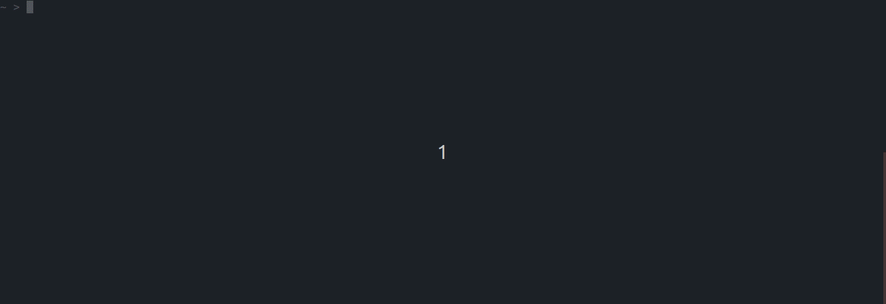

# Como criar fórmulas

## Como criar?

### Passo 1: Execute o comando de criação de formula

Para começar, você deve informar alguns dados para os seguintes argumentos:

1. O **comando** \(de preferência, com o **padrão `rit + grupo + verbo + substantivo`**\)
2. A **linguagem de programação** da fórmula. 
3. **O caminho** para salvar os arquivos da fórmula. 

**Exemplo:** rit github update repository

Em seguida, use esse comando para criar uma fórmula:

```text
$ rit create formula
```


### **Passo 2: Teste sua fórmula** 

Você pode testar diretamente a fórmula depois de sua criação. Isso é possível porque o comando **`rit create formula`** também constrói a fórmula automaticamente \(ela gera os arquivos executáveis da fórmula e adiciona-os no **.rit folder**\).

Nesse caso, o template da formula **"Hello World"** será executado como mostrado abaixo: 



Este template é composto por **3 parâmetros de entrada**, que representam os tipos de inputs atualmente disponíveis para serem usados no Ritchie:

1. Uma amostra da variável de texto 
2. Uma amostra da lista de variáveis 
3. Uma amostra das variáveis booleanas 

## Próximos passos

Nessa seção, você viu como criar e testar uma fórmula no Ritchie. Para continuar configurando a fórmula: 

👉 Vá para a seção de como[ **implementar uma  fórmula**](como-implementar-uma-formula.md) para entender como editar os arquivos que o Ritchie cria depois da criação de uma fórmula. 

👉 Vá para [**como fazer o build da fórmula**](build-a-formula.md) para ver como continuar os testes nas fórmulas que você criou. 

\*\*\*\*

